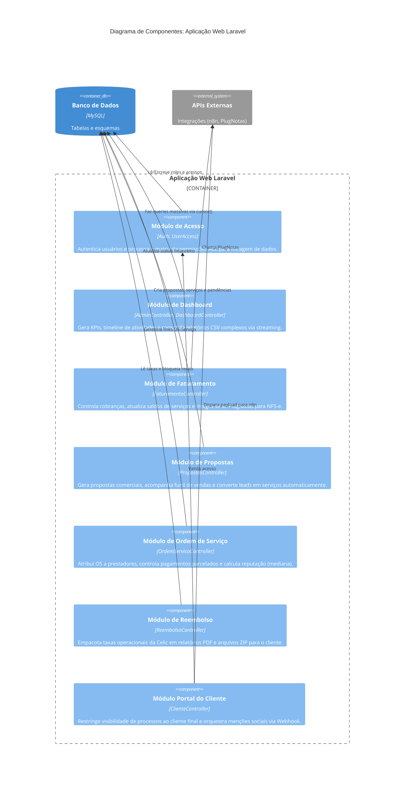

# C4 Model: Diagrama de Componentes (Nível 3)

Focando no container da **Aplicação Web Monolítica (Laravel)**, este diagrama detalha as peças internas (Módulos de Negócio/Controllers) e suas responsabilidades.

