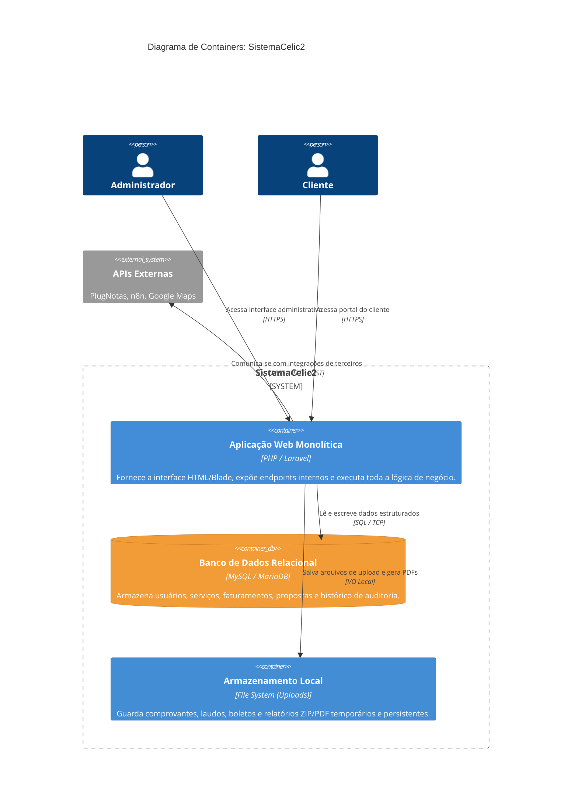

# C4 Model: Diagrama de Containers (Nível 2)

Detalha as peças estruturais que compõem o SistemaCelic2. Como se trata de um monolito tradicional, a estrutura de containers é relativamente simples, focando na separação entre a aplicação, o banco de dados e o armazenamento de arquivos.

