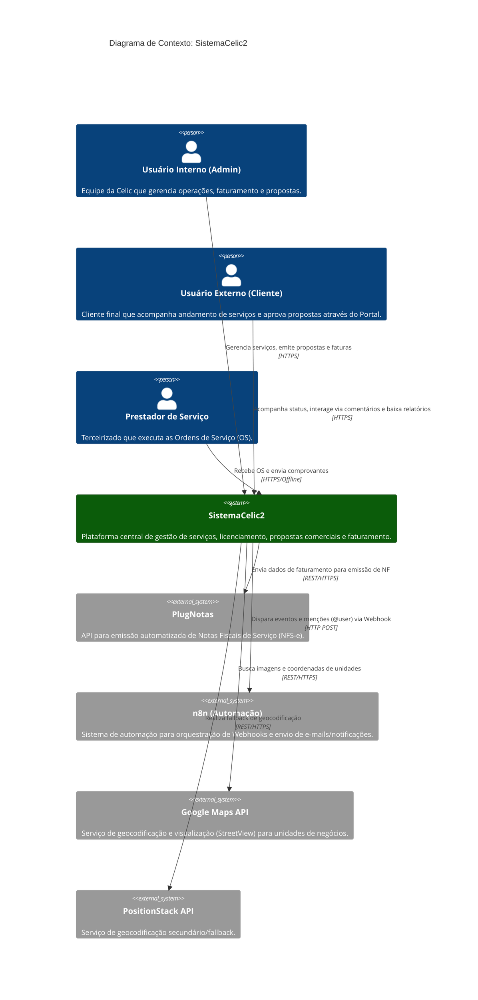

# C4 Model: Diagrama de Contexto (Nível 1)

O Diagrama de Contexto mostra o SistemaCelic2 no centro de seu ambiente, destacando os usuários (personas) que interagem com ele e os sistemas externos com os quais ele se integra.

