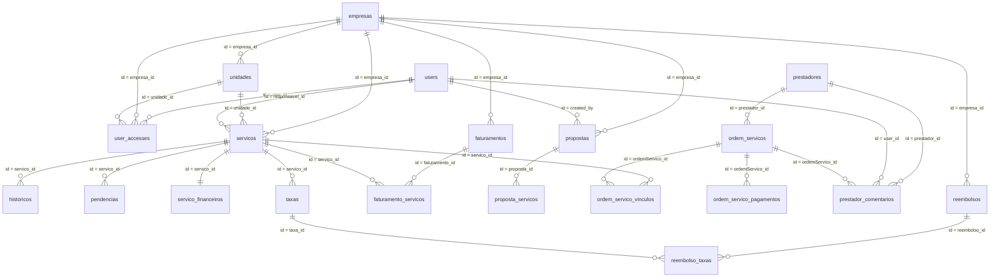

# Entity-Relationship Diagram (ERD) — Nível de Banco de Dados

Diagrama estrutural focado nas chaves e tabelas físicas (inferido a partir do ORM Eloquent).

```mermaid
erDiagram
    users ||--o{ user_accesses : "id = user_id"
    empresas ||--o{ user_accesses : "id = empresa_id"
    unidades ||--o{ user_accesses : "id = unidade_id"
    
    empresas ||--o{ unidades : "id = empresa_id"
    empresas ||--o{ servicos : "id = empresa_id"
    unidades ||--o{ servicos : "id = unidade_id"
    
    users ||--o{ servicos : "id = responsavel_id"
    
    servicos ||--o{ historicos : "id = servico_id"
    servicos ||--o{ pendencias : "id = servico_id"
    servicos ||--|| servico_financeiros : "id = servico_id"
    servicos ||--o{ taxas : "id = servico_id"
    
    empresas ||--o{ faturamentos : "id = empresa_id"
    faturamentos ||--o{ faturamento_servicos : "id = faturamento_id"
    servicos ||--o{ faturamento_servicos : "id = servico_id"
    
    empresas ||--o{ propostas : "id = empresa_id"
    users ||--o{ propostas : "id = created_by"
    propostas ||--o{ proposta_servicos : "id = proposta_id"
    
    servicos ||--o{ ordem_servico_vinculos : "id = servico_id"
    ordem_servicos ||--o{ ordem_servico_vinculos : "id = ordemServico_id"
    prestadores ||--o{ ordem_servicos : "id = prestador_id"
    ordem_servicos ||--o{ ordem_servico_pagamentos : "id = ordemServico_id"
    
    prestadores ||--o{ prestador_comentarios : "id = prestador_id"
    users ||--o{ prestador_comentarios : "id = user_id"
    ordem_servicos ||--o{ prestador_comentarios : "id = ordemServico_id"
    
    empresas ||--o{ reembolsos : "id = empresa_id"
    reembolsos ||--o{ reembolso_taxas : "id = reembolso_id"
    taxas ||--o{ reembolso_taxas : "id = taxa_id"
```
