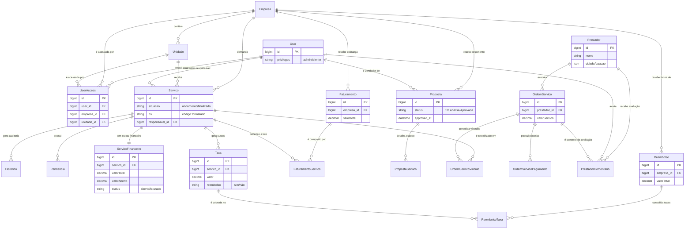

# Entity-Relationship Diagram (ERD) Completo

Diagrama modelando as principais entidades e relacionamentos do SistemaCelic2.

```mermaid
erDiagram
    User ||--o{ UserAccess : "possui acessos"
    Empresa ||--o{ UserAccess : "é acessada por"
    Unidade ||--o{ UserAccess : "é acessada por"
    
    Empresa ||--o{ Unidade : "contém"
    Empresa ||--o{ Servico : "demanda"
    Unidade ||--o{ Servico : "recebe"
    
    User ||--o{ Servico : "atua como responsável"
    
    Servico ||--o{ Historico : "gera auditoria"
    Servico ||--o{ Pendencia : "possui"
    Servico ||--|| ServicoFinanceiro : "tem status financeiro"
    Servico ||--o{ Taxa : "gera custos"
    
    Empresa ||--o{ Faturamento : "recebe cobrança"
    Faturamento ||--o{ FaturamentoServico : "é composto por"
    Servico ||--o{ FaturamentoServico : "pertence a lote"
    
    Empresa ||--o{ Proposta : "recebe orçamento"
    User ||--o{ Proposta : "é vendedor de"
    Proposta ||--o{ PropostaServico : "detalha escopo"
    
    Servico ||--o{ OrdemServicoVinculo : "é terceirizado em"
    OrdemServico ||--o{ OrdemServicoVinculo : "consolida vínculos"
    Prestador ||--o{ OrdemServico : "executa"
    OrdemServico ||--o{ OrdemServicoPagamento : "possui parcelas"
    
    Prestador ||--o{ PrestadorComentario : "recebe avaliação"
    User ||--o{ PrestadorComentario : "avalia"
    OrdemServico ||--o{ PrestadorComentario : "é contexto da avaliação"
    
    Empresa ||--o{ Reembolso : "recebe fatura de"
    Reembolso ||--o{ ReembolsoTaxa : "consolida taxas"
    Taxa ||--o{ ReembolsoTaxa : "é cobrada no"

    User {
        bigint id PK
        string privileges "admin/cliente"
    }
    UserAccess {
        bigint id PK
        bigint user_id FK
        bigint empresa_id FK
        bigint unidade_id FK
    }
    Servico {
        bigint id PK
        string situacao "andamento/finalizado"
        string os "código formatado"
        bigint responsavel_id FK
    }
    ServicoFinanceiro {
        bigint id PK
        bigint servico_id FK
        decimal valorTotal
        decimal valorAberto
        string status "aberto/faturado"
    }
    Faturamento {
        bigint id PK
        bigint empresa_id FK
        decimal valorTotal
    }
    Proposta {
        bigint id PK
        string status "Em análise/Aprovada"
        datetime approved_at
    }
    OrdemServico {
        bigint id PK
        bigint prestador_id FK
        decimal valorServico
    }
    Prestador {
        bigint id PK
        string nome
        json cidadeAtuacao
    }
    Reembolso {
        bigint id PK
        bigint empresa_id FK
        decimal valorTotal
    }
    Taxa {
        bigint id PK
        bigint servico_id FK
        decimal valor
        string reembolso "sim/não"
    }
```
