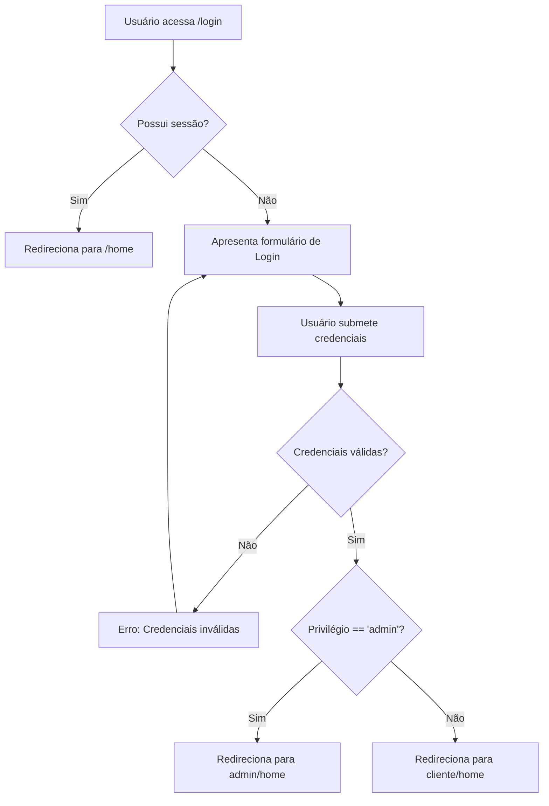

# Fluxograma do Módulo Auth — SistemaCelic2

## Fluxo de Login e Redirecionamento



## Fluxo de Recuperação de Senha

```mermaid
graph TD
    A[Acessa /password/reset] --> B[Informa e-mail]
    B --> C[Sistema envia e-mail com Token]
    C --> D[Usuário clica no link do e-mail]
    D --> E[Acessa /password/reset/{token}]
    E --> F[Informa nova senha]
    F --> G{Token válido?}
    G -- Não --> H[Erro: Token expirado/inválido]
    G -- Sim --> I[Atualiza senha e faz login]
    I --> J[Redireciona conforme privilégio]
```
