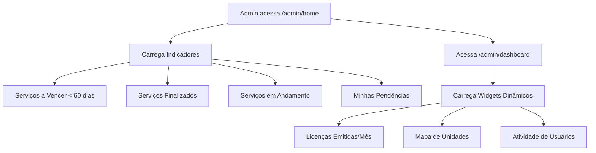
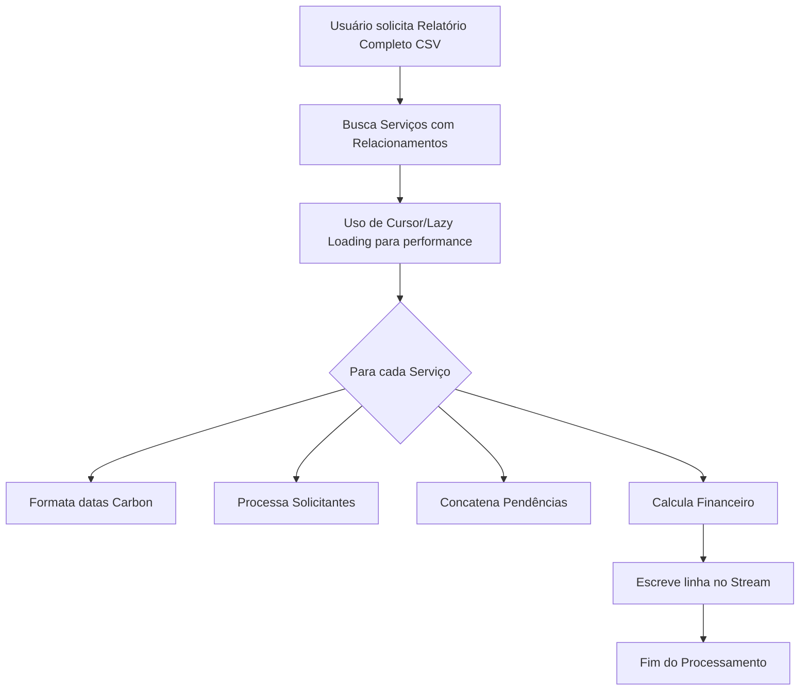

# Fluxograma do Módulo Dashboard — SistemaCelic2

## Visualização de Indicadores (Admin)

```mermaid
graph TD
    A[Admin acessa /admin/home] --> B[Carrega Indicadores]
    B --> C[Serviços a Vencer < 60 dias]
    B --> D[Serviços Finalizados]
    B --> E[Serviços em Andamento]
    B --> F[Minhas Pendências]
    
    A --> G[Acessa /admin/dashboard]
    G --> H[Carrega Widgets Dinâmicos]
    H --> I[Licenças Emitidas/Mês]
    H --> J[Mapa de Unidades]
    H --> K[Atividade de Usuários]
```

## Geração de Relatórios CSV

```mermaid
graph TD
    A[Usuário solicita Relatório Completo CSV] --> B[Busca Serviços com Relacionamentos]
    B --> C[Uso de Cursor/Lazy Loading para performance]
    C --> D{Para cada Serviço}
    D --> E[Formata datas Carbon]
    D --> F[Processa Solicitantes]
    D --> G[Concatena Pendências]
    D --> H[Calcula Financeiro]
    H --> I[Escreve linha no Stream]
    I --> J[Fim do Processamento]
```
