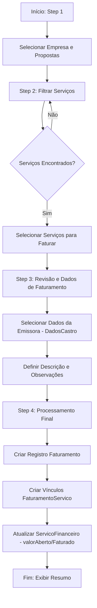

# Fluxograma do Módulo Faturamento — SistemaCelic2

## Processo de Faturamento (Wizard 4 Passos)



## Lógica de Atualização Financeira

```mermaid
graph TD
    A[Recebe Valor a Faturar] --> B{Já possui faturamento?}
    
    B -- Não --> C{Valor == Total?}
    C -- Sim --> D[Status: Faturado | Aberto: 0]
    C -- Não --> E[Status: Parcial | Aberto: Total - Faturar]
    
    B -- Sim --> F{Novo Total == Total?}
    F -- Sim --> G[Status: Faturado | Aberto: 0]
    F -- Não --> H[Status: Parcial | Aberto: Aberto Anterior - Faturar]
```
