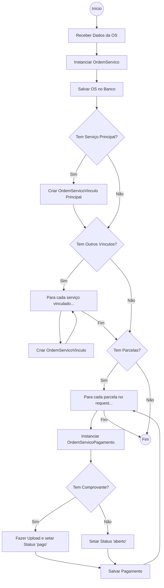
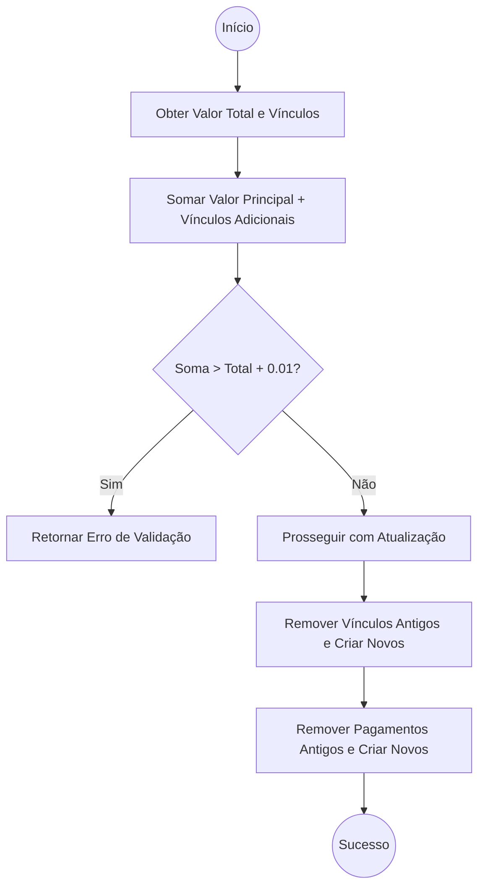
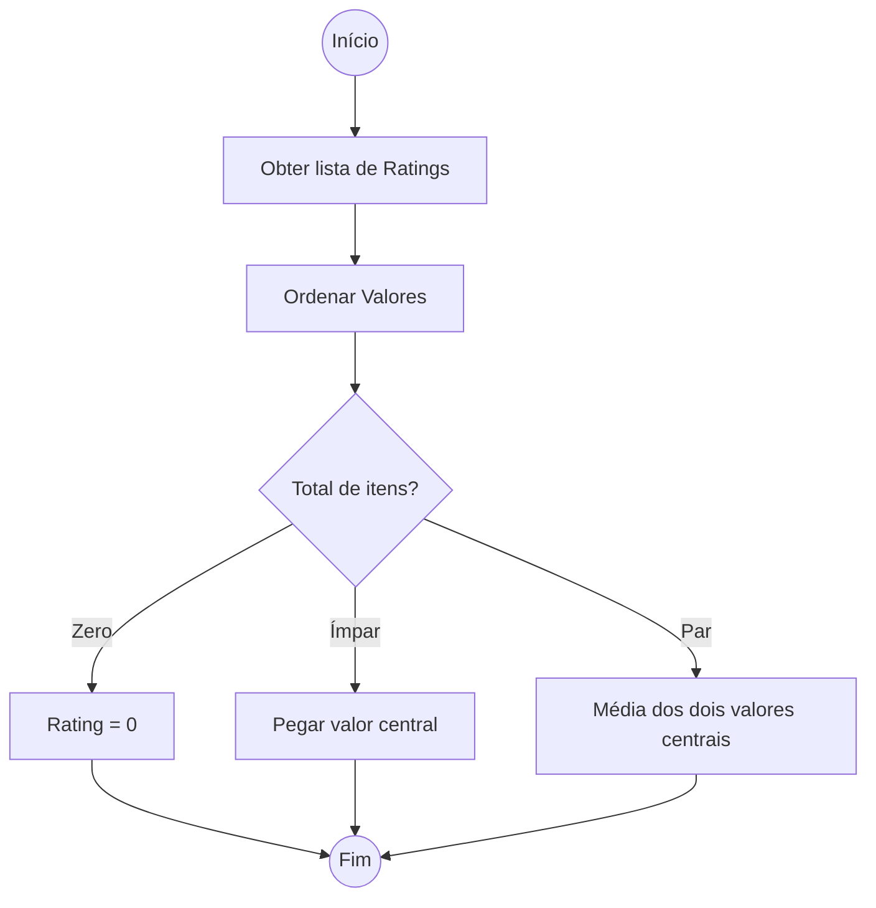

# Fluxogramas: Ordem de Serviço

## 1. Ciclo de Criação e Parcelamento
Este fluxo descreve como uma OS é registrada e como suas parcelas financeiras são geradas.

## 2. Validação de Atualização
O sistema impede que a soma dos serviços vinculados exceda o valor total da OS.

## 3. Lógica de Rating (Mediana)
Algoritmo utilizado para calcular a reputação do prestador.

