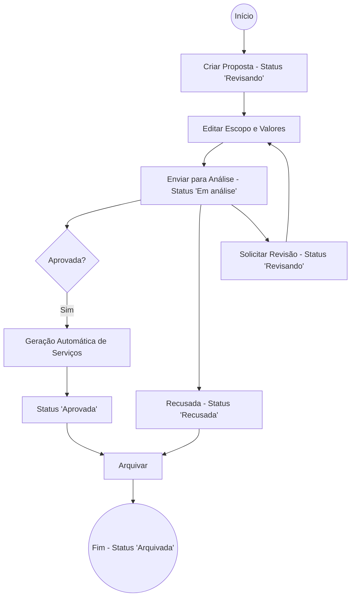
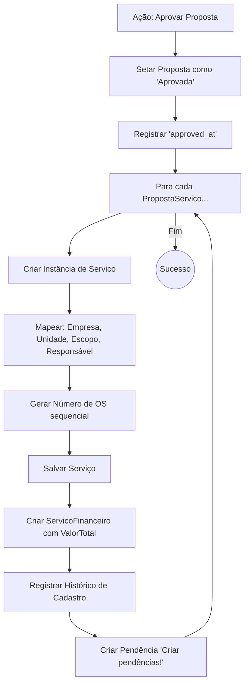
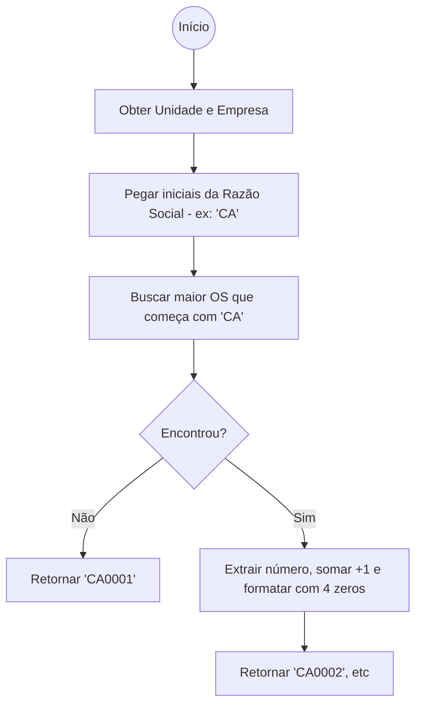

# Fluxogramas: Proposta Comercial

## 1. Ciclo de Vida da Proposta
Fluxo de estados e transições de uma proposta desde a criação até o arquivamento.

## 2. Lógica de Conversão (Aprovação)
O que acontece internamente quando o botão "Aprovar" é acionado.

## 3. Geração de Número de OS
Algoritmo de `getLastOs`.

