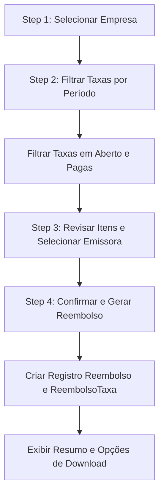

# Fluxogramas: Reembolso de Taxas

## 1. Processo de Fechamento de Reembolso
Fluxo do Wizard de Reembolso (4 etapas).



## 2. Lógica de Empacotamento (ZIP)
Como o sistema organiza os arquivos para o cliente.

```mermaid
graph TD
    Start((Início)) --> CreateDir[Criar Diretório Temporário id/ ]
    CreateDir --> GenPDF[Gerar Relatório Consolidado PDF]
    GenPDF --> SavePDF[Salvar no Diretório: 'Reembolso - [Nome].pdf']
    
    SavePDF --> Loop[Para cada Taxa no Reembolso...]
    Loop --> HasComp{Tem Comprovante?}
    HasComp -- Sim --> CopyComp[Copiar e Renomear: 'Item X - Comprovante.ext']
    HasComp -- Não --> HasBoleto{Tem Boleto?}
    
    CopyComp --> HasBoleto
    HasBoleto -- Sim --> CopyBoleto[Copiar e Renomear: 'Item X - Boleto.ext']
    HasBoleto -- Não --> Loop
    
    CopyBoleto --> Loop
    Loop -- Fim --> Zip[Compactar Diretório em .ZIP]
    Zip --> Download[Disponibilizar para Download]
```
