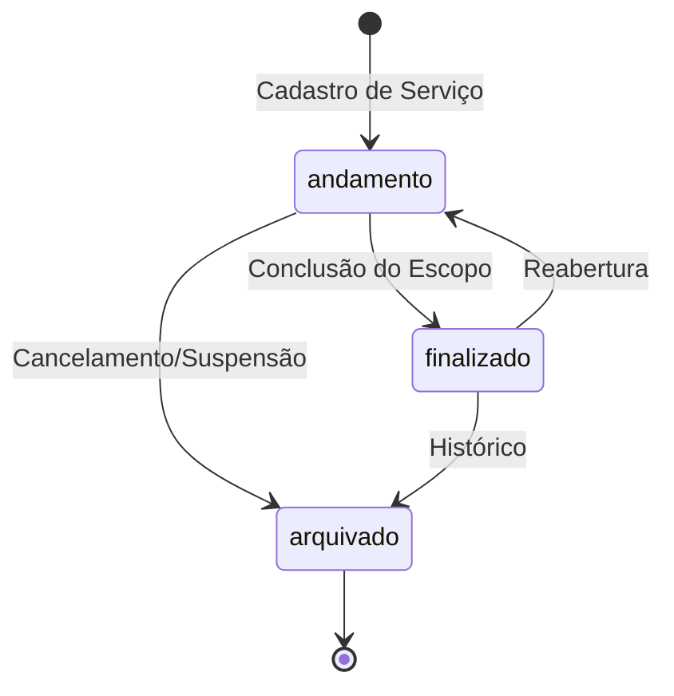
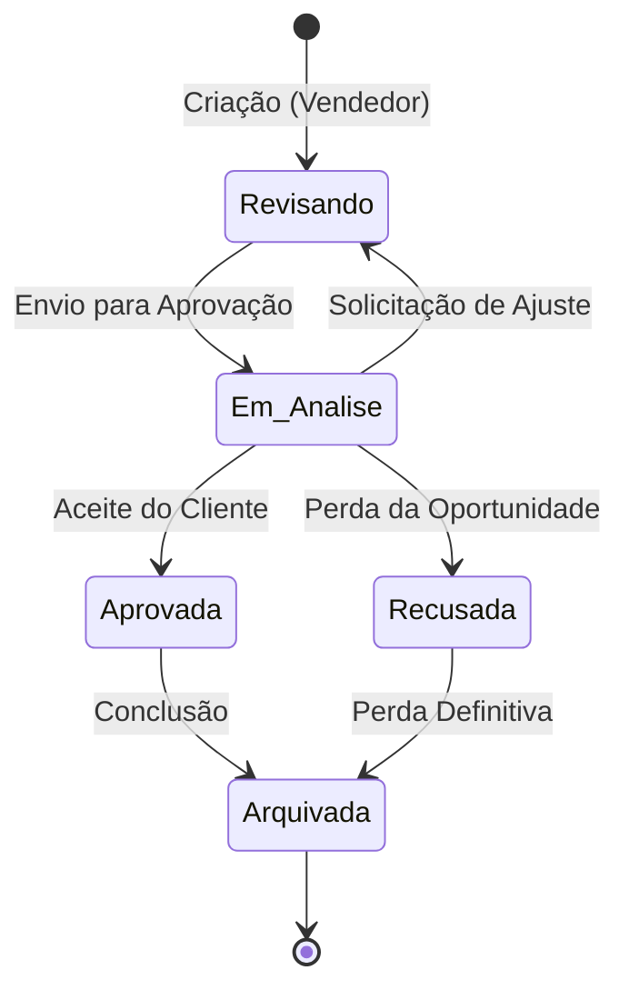
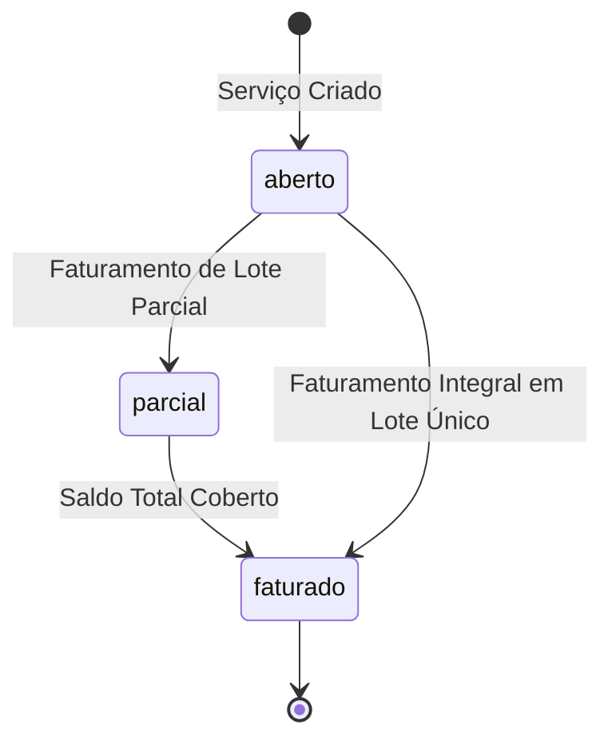
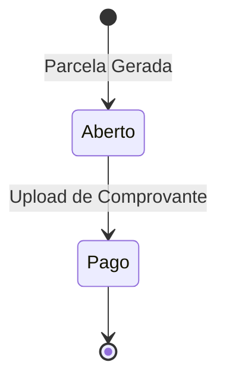

# Máquinas de Estado — SistemaCelic2

O sistema gerencia o ciclo de vida de diversas entidades através de campos de status e gatilhos lógicos.

## 1. Ciclo de Vida do Serviço
Entidade central que representa o fluxo de trabalho operacional.

- **andamento:** Estado inicial. Permite anexar arquivos, criar pendências e lançar taxas.
- **finalizado:** Bloqueia edições operacionais, mas permite faturamento e reembolso.
- **arquivado:** Oculto das listagens principais.

## 2. Fluxo da Proposta Comercial
Gerencia o processo de negociação.

- **Aprovada:** Gatilho para criação automática de Serviços (`PropostasController@aprovar`).

## 3. Estado Financeiro do Serviço
Controlado pela entidade `ServicoFinanceiro`.

- **Cálculo:** `valorAberto = valorTotal - valorFaturado`.
- **Transição:** Automática via `FaturamentoController@confirmar`.

## 4. Ordem de Serviço (OS) e Pagamentos
Fluxo de execução externa.

- **Lógica:** A presença de um arquivo no campo `comprovante` força o status para `pago`.

## Escala de Confiança
- **Transições de Serviço:** 🟢 CONFIRMADO
- **Estados de Proposta:** 🟢 CONFIRMADO
- **Estados Financeiros:** 🟢 CONFIRMADO
